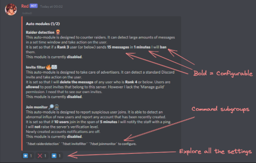
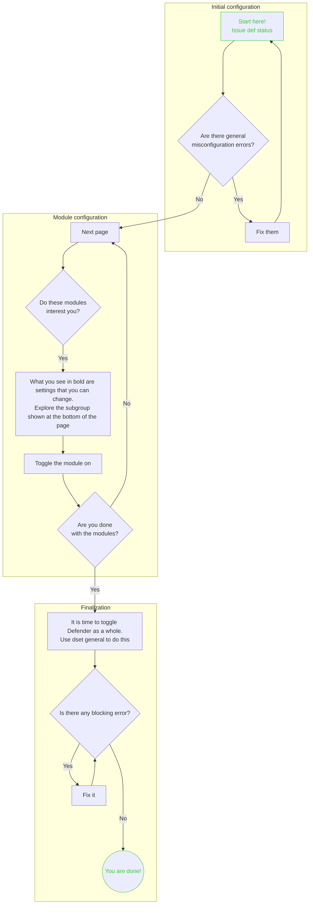

# Configuration

## Before starting

Think a little about how your community is structured:

- Which category of roles (users) rarely cause problems?
- Which is the role that you *really* trust? Users who could even help you moderate for brief amounts of time?

The answer to these questions will be important during configuration.  
The modules with the most severe effects should, ideally, not affect your highest rank.

!!! important

    Setting Red's core admin and mod roles is **mandatory**. You will not be able to
    enable Defender until you set them. See the core `[p]set` command.

Creating a ad-hoc channel for Defender notifications is recommended.  
While Defender takes precautions to ensure that the channel will not be spammed by notifications,
it can get intense at times. Plus, having a separate channel allows your staff to better set up their Discord notifications.

## What to do

Assuming you have already installed and loaded the Defender cog, you are now ready to set things up.  

!!! important

    It's of paramount importance that you understand how [Ranks](/defender-docs/#ranks) work before configuring Defender.
    As a general rule, you may want most if not all of the modules to **only target Rank 2 or below.**

Consider the command `[p]def status` your central control panel for all things Defender.  
From there you can see its overall status plus the status *and* settings of each module.  
It also serves as your guide when you set things up, as at the bottom of each separate page it will show you which subgroup of commands (in `[p]dset`) to further explore.  

<figure markdown>
  
  <figcaption>The [p]def status command</figcaption>
</figure>

As mentioned in the [Overview page](/defender-docs/), you can choose which functionalities you want to be active. In order to get things up and running, you have to decide which modules you want to use, set them up and toggle them on.  
Once you've done that (and fixed any general misconfiguration issue), you are ready to turn on Defender as a whole from the `[p]dset general` subgroup.

If you are familiar with exploring Red's commands the configuration process should be relatively straightforward as long as you set time aside and ready up for some reading.

## A maybe helpful flowchart

