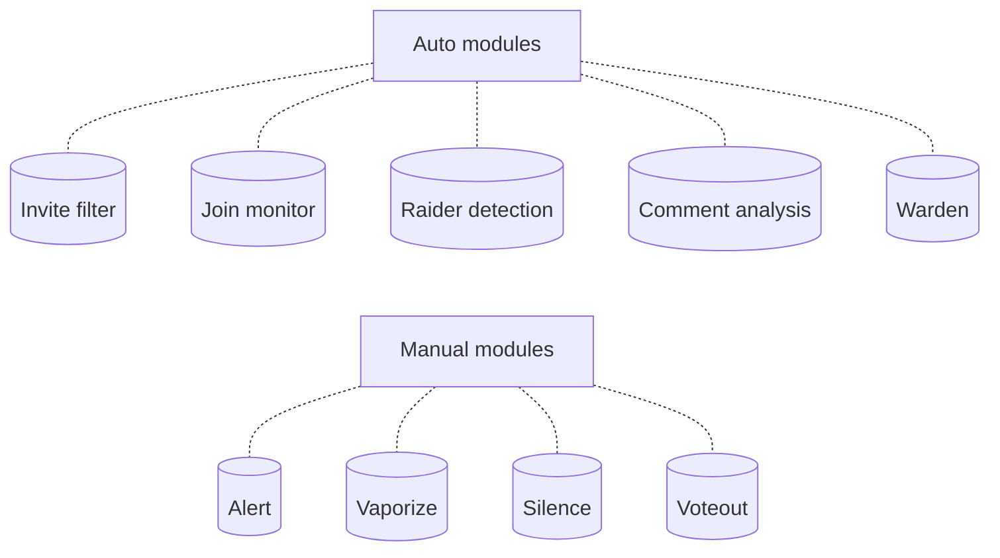
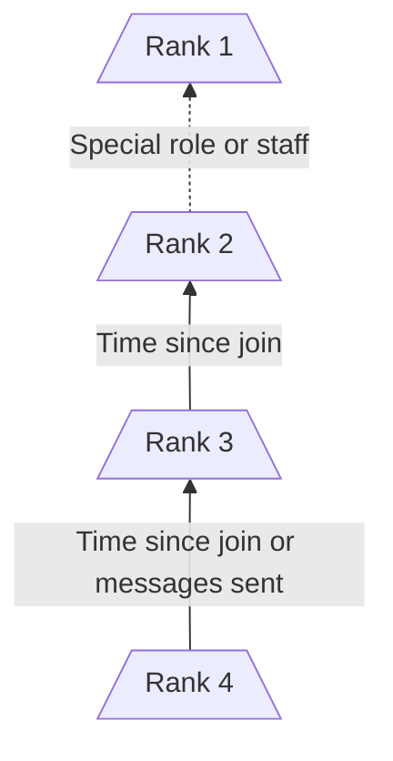
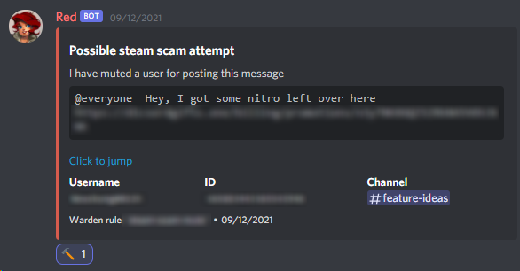

# Overview

Welcome to the documentation of [Defender](https://github.com/Twentysix26/x26-Cogs/).  
Defender is a big and complex cog but I promise that if you hang in there you could *just* make it ;)  
It is recommend that you first read this page and then head to the [configuration guide](/defender-docs/configuration).

## What is Defender

Defender is what could best be defined as a suite of tools aimed primarily at rendering your Discord community safe and secure.  
Functionalities are splits in modules:  

- `Auto modules`, which are automated moderation and monitoring functionalities
- `Manual modules`, which are tools that you can use in time of need

Each module is *optional*, meaning that you can decide to only enable specific parts of Defender.  
Despite being designed to counter serious threats Defender can also be a very valuable tool for smaller communities with less traffic.

=== "Auto modules"
    | Module      | Description                          |
    | ----------- | ------------------------------------ |
    | Invite filter       | Detects and takes action on unwanted Discord invites posted in your community |
    | Join monitor       | Detects surges of users joining your server and notifies the staff about newly created accounts. It can also raise your server's verification level if it detects a raid. |
    | Raider detection    | Also commonly referred as antispam / antiraid, it takes action on users spamming messages. |
    | Comment analysis    | Leverages the power of machine learning to detect a wide range of potentially unwanted messages. Powered by Google's Perspective API. |
    | Warden    | A complex module that lets you define *rules*. Rules are sets of *conditions* and *actions* that you can define to automate moderation, monitoring and much more. If something isn't covered by the other modules, it can probably be done with Warden.|

=== "Manual modules"
    | Module      | Description                          |
    | ----------- | ------------------------------------ |
    | Alert       | Allows your helper roles to report threats to the staff. Upon "ringing the bells" the staff is privately pinged with detailed context as to where the emergency is taking place. Additionally, this module can be configured so that after a certain time with no staff activity the server enters a state of emergency and certain modules (such as voteout) are rendered available to helpers. |
    | Vaporize       | Particularly effective against raids. It provides a quick way to ban vast amounts of new users without creating new mod-log entries. |
    | Silence    | Upon activation, it is able to instantly delete messages from certain ranks. This is particularly useful when a raid is in progress. |
    | Voteout    | Starts a voting session to expel a user. This module was designed specifically for emergency mode so that when the staff is absent helper roles are still able to take care of things by themselves. |

All these modules deliver notifications to your designed Defender *notification channel*.  
For more information about how to effectively set up your server for Defender, see the [configuration guide](/defender-docs/configuration).

## Ranks

Defender categorizes your userbase into different ranks. They range from **Rank 1**, your most trusted users until **Rank 4**, new users with little to no activity in your server.  
Thanks to this system, you are able to set up each different module so that they only target people below a certain rank, meaning that your regular users will be safe from the many safety measures that Defender offers.  
A regular user will only be able to rank up until Rank 2. Rank 1 is considered a special rank that can only be attained through designed roles or by being a staff member.

  | Rank      | Description                          |
  | ----------- | ------------------------------------ |
  | 1    | Staff, trusted roles and helper roles |
  | 2    | Regular users who don't fit in any of the lower ranks |
  | 3    | Users who joined less than X days ago. Configurable. |
  | 4    | Users who joined less than X days ago and have sent fewer than Y messages. Configurable. |

!!! tip

    Want to know which Rank a particular user is? Use `[p]def identify <user>`

## Emergency mode

`Emergency mode` is a feature meant to help when nobody in your staff team is online; it can be triggered by the `Alert` manual module described above.  
During configuration you can choose to assign a number of manual modules to emergency mode.  
After your designated helper roles issue a `[p]alert` / `[p]staff` Defender will wait for a time for your staff team to take any action in the server.  
In case your staff team doesn't respond for X minutes, emergency mode will be triggered. Users with the helper roles will be able to use the emergency modules, and depending on which ones you chose, they'll be able to deal with the threat by themselves.  
Defender will periodically check for activity by your staff team and upon detecting it, it will  disable emergency mode.

## Quick actions
It is possible to act on Defender's standard notifications by reacting on them. It is also possible to make Warden rules that support this.  

<figure markdown>
  
  <figcaption>A ban reaction on a notification</figcaption>
</figure>

  | Emoji      | Action                          |
  | ----------- | ------------------------------------ |
  | 🔨 `:hammer:` | Ban |
  | 🔂 `:repeat_one:` | Ban with 24 hours message deletion |
  | 💨 `:dash:` | Softban |
  | 👢 `:boot:` | Kick |
  | 👊 `:punch:` | Punish |

!!! tip

    On your Discord client you can favorite the emoji of your most used actions with alt+click
